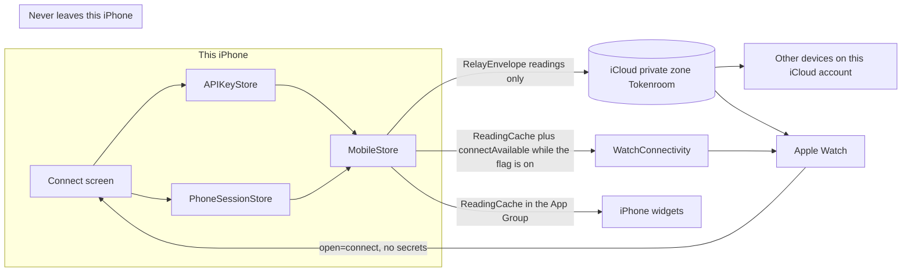
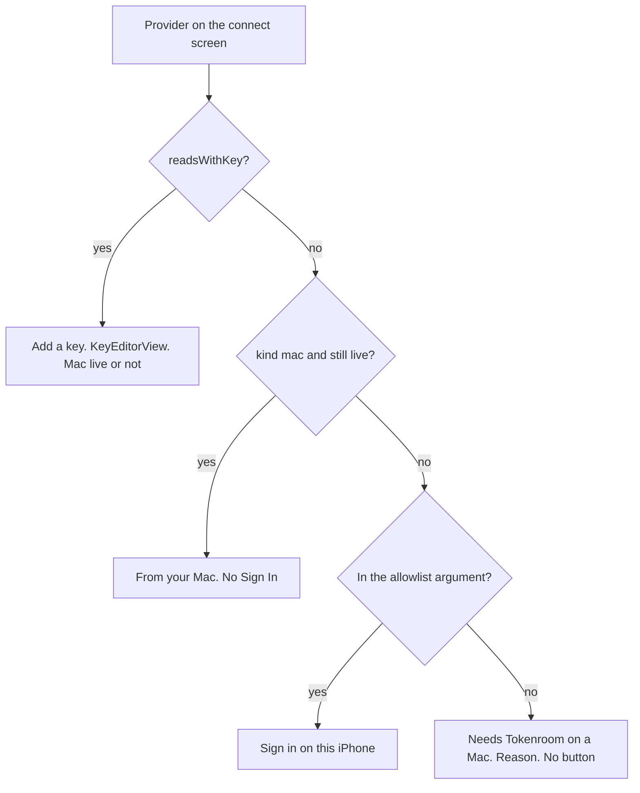
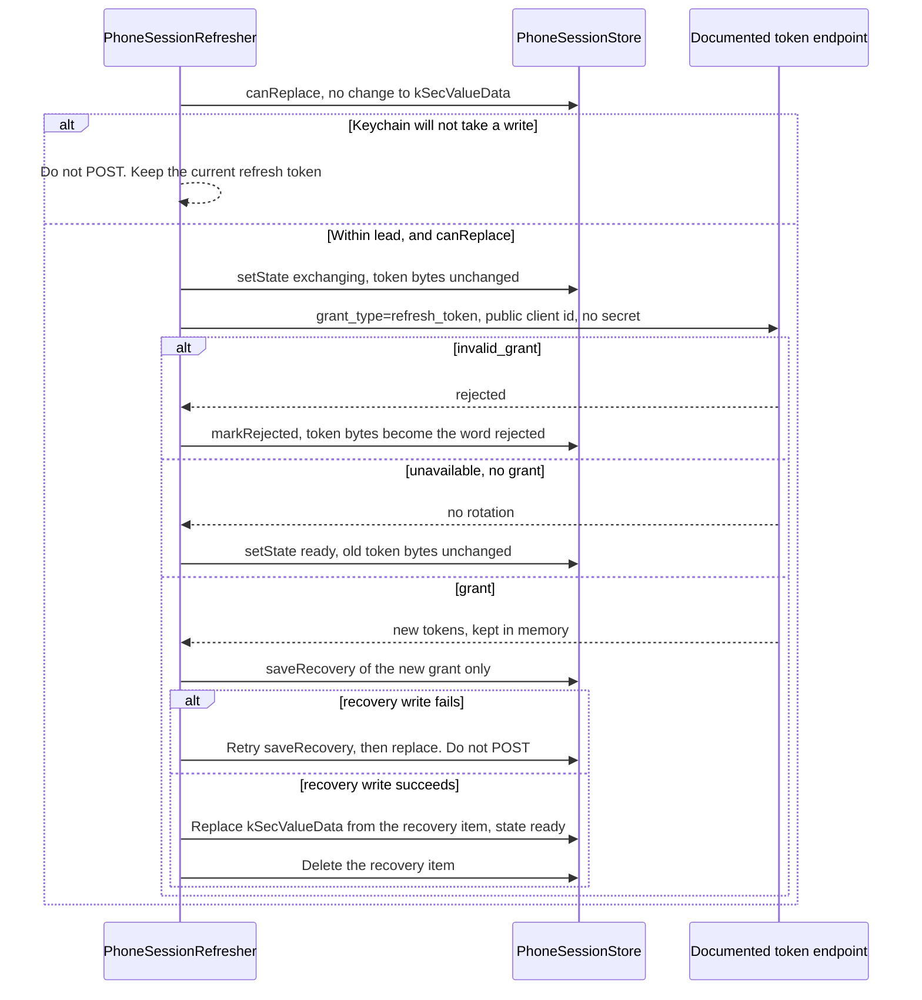
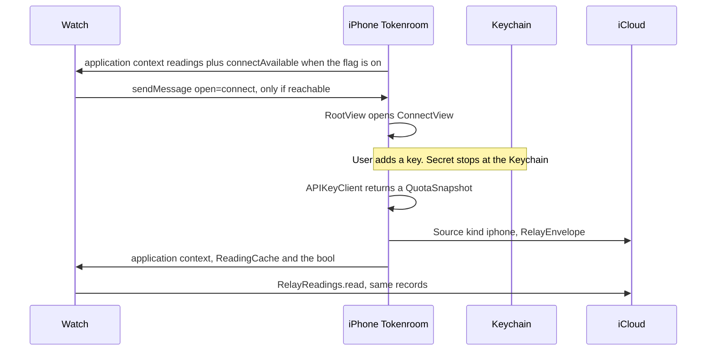

# iPhone sign-in for Tokenroom when the user has no Mac

| | |
|---|---|
| Author | (owner) |
| Date | 2026-10-01 |
| Status | Draft |
| Repo | `felipedrf74/tokenroom` |
| Scope | Design only. Not an implementation. Not a Mac 2.2.4 change. Not an App Store submission. |

## Overview

A person with Tokenroom on iPhone and Apple Watch, and no Mac, can already read every provider that has a key or a documented billing API: they paste the key in `KeysView`, `MobileStore.publish` writes a CloudKit `Source` of kind `iphone`, and the Watch shows that reading. They cannot sign in to Claude, Codex, Grok Build, Grok Bot, Cursor, Antigravity, or Devin. Those logins exist only inside another tool on a Mac. `SignInCoordinator` is AppKit. It opens Terminal or a Mac app. It does not speak OAuth, and the iPhone has no `ASWebAuthenticationSession`, device-code sheet, or PKCE flow.

The plan is not to grow a second copy of those CLI logins on the phone. The CLI client ids, user-agents, and usage hosts are the vendor’s, they are unofficial, and Anthropic has said subscription OAuth is not for third-party apps. The iPhone becomes a complete collector for the providers it can already read honestly, and it tells the truth about the rest: no Sign In button that cannot finish. A `PhoneSessionStore` is the slot for a later session whose vendor documents a public client and a usage read, with no client secret and no identity stored. It uses the same accessibility and not-synchronizable flags as `APIKeyStore`, but the access group is the iPhone app’s own application identifier, not the widget-shared group and not an omitted attribute. Nothing in that slot is wired to a provider in this design. `PhoneConnect.productionAllowlist` starts empty.

The Watch never collects a password, a key, or a session. It can ask the iPhone to open `ConnectView`. iCloud carries readings only. WatchConnectivity carries that same readings cache and, only while the flag is on, the non-secret bool `connectAvailable` in the same dictionary. No token crosses either path. That keeps the `RelayEnvelope` and `PRIVACY.md` rule, plus that one bool.

## Background & Motivation

Tokenroom has no server and no account. The Mac collects from tools that already keep a login. The iPhone collects with keys it stores itself. The Watch only reads. That split is the product, and it is why a phone-only person currently sees “Sign in to these on your Mac…” in `UsageView.disconnectedFooter` with nothing to tap.

What the phone can do today is easy to miss. Onboarding offers Connect your Mac, Add an API key, or sample data. The key path is the whole no-Mac product, and it is buried under a sentence about the Mac. Copilot’s documented path on the phone is a fine-grained token (`Provider.copilot.fallbackKey`, `APIKeyClient.copilotSnapshot`). The Mac’s `gh auth login` path does not exist on iOS, and it should not be rebuilt there.

What the phone must not do is replay `LoginSession`. That actor renews Claude, Grok Build, and Codex inside the tool’s own login and deletes a temporary recovery item (`LoginRecovery`, service `app.tokenroom.mac.login-recovery`). The store is the macOS login keychain or `~/.codex/auth.json` / `~/.grok/auth.json`. The Claude call sends the CLI user-agent and `x-app: cli`. The Grok client id is whatever `oidc_client_id` the CLI wrote, not a constant compiled for Tokenroom. Cursor and Grok Bot have no refresh in this repo at all. Copying any of that into the iOS target is a terms, App Review, and breakage risk, and it would make `docs/app-store.md` false in a way App Review can see.

Mac 2.2.4 is an uncommitted local keychain fix for that Mac renewal path. It is unrelated. iPhone and Watch 1.0.1 build 3 are already waiting for review. This work does not cancel that build and does not ship in the same pull request as the Mac fix.

## Goals & Non-Goals

### Goals

- A person with no Mac can connect every provider the iPhone is allowed to read, from onboarding, without being told to sign in on a computer they do not have.
- Providers with no documented third-party usage API show a specific reason and no button.
- A future phone session, if a vendor ever allows one, lives only in this iPhone’s Keychain. It is the session, not a copy of a CLI file. It never enters CloudKit, the App Group cache, a widget payload, or the Watch.
- When a Mac is publishing a live reading for a provider, the iPhone does not start a second OAuth login for it. A pasted key for that same provider stays available. Settings can tell “On this iPhone”, “From your other iPhone”, and “From your Mac”.
- Renewal of a phone session, when one exists, uses `OAuthRefresh.lead` (180 seconds) and refuses to exchange a refresh token unless the new one can be stored.
- The new connect UI is behind a flag. Hiding it is the rollback. Keys and the Mac relay keep working.
- Privacy sentences stay true.

### Non-Goals

- Impersonating the Claude CLI, the Codex CLI, or the Grok CLI, including their client ids, `x-app: cli`, their user-agents, and their unofficial usage URLs (`api.anthropic.com` OAuth usage, `chatgpt.com` wham usage, `cli-chat-proxy.grok.com`).
- Moving `ClaudeClient`, `OpenAIClient`, or `GrokClient` into an iOS target, or moving any unofficial parser into `Shared/` for this work.
- A Tokenroom server, a client secret in the binary, associated domains, or a universal-link callback.
- Sign-in UI on the Watch. Keys or sessions on the Watch. iCloud Keychain sync of secrets.
- Reading or storing email, name, account id, organization id, or an id token.
- Changing Mac renewal, publishing Mac 2.2.4, or submitting an App Store version.
- Solving double alerts when two iPhones hold the same key. `MobileStore.sendAlerts` already ignores Mac coverage only, on purpose. This design leaves that as it is.
- Replacing pasted keys for Z.ai, Kimi Code, MiniMax, OpenCode Go, OpenRouter, DeepSeek, Moonshot, Vercel, or the three organization admin keys.

## Proposed Design

### Provider-by-provider

“Official?” in the table means a documented third-party usage API called with `TokenroomIdentity.userAgent`. It is not `Provider.isUnofficial`. That property is `access == .localLogin`, and `access` looks only at `descriptor.key`, not `fallbackKey`. Copilot has `fallbackKey` and no `key`, so `isUnofficial` is true while the billing API is official. Z.ai, Kimi Code, MiniMax, and OpenCode Go have `key` set, so `isUnofficial` is false, while `PRIVACY.md` calls several of those usage endpoints undocumented. `PhoneConnect.action` must not call `isUnofficial`. It uses `readsWithKey`, `productionAllowlist`, and Mac coverage. Using `isUnofficial` as `.needsMac` would hide Copilot’s token row. The Mac column is the current collector, not the proposal.

| Provider | Today on iPhone | Proposed iPhone action | Watch | Official? | Blocker |
|---|---|---|---|---|---|
| Grok Build (`.grok`) | Disconnected. Footer points at the Mac. | No button. “Needs Tokenroom on a Mac. Grok Build doesn’t offer a usage API for other apps.” | Shows a Mac reading after the iPhone or iCloud delivers it. Otherwise the empty state. | Mac path is unofficial. | No documented public client whose scope is plan usage. xAI’s management API is `.xaiOrg`, already a pasted key, and it is spend, not the Build pool. |
| Grok Bot (`.grokBot`) | Same. | No button. “Needs Tokenroom on a Mac. Grok Bot keeps its login in the Mac app.” | Same. | Unofficial (`api2.cursor.sh` bearer). | No mint and no refresh in this repo. The token is in the Mac keychain or Cursor’s database. |
| Claude (`.claude`) | Same. | No button. “Needs Tokenroom on a Mac. Claude’s plan login isn’t available to other apps.” | Same. | Mac path is unofficial (`OAuthRefresh.claudeClientID`, CLI user-agent, `anthropic-beta: oauth-2025-04-20`). | Anthropic documents admin keys for org cost (already `.anthropicOrg`) and does not document a third-party client for Pro/Max usage. Subscription OAuth is for Claude Code and Anthropic’s own apps. |
| OpenAI / Codex (`.openai`) | Same. | No button. “Needs Tokenroom on a Mac. ChatGPT plan limits aren’t available to other apps.” | Same. | Mac path is unofficial (`chatgpt.com` wham usage, `OAuthRefresh.codexClientID`). | No documented read of the weekly subscription windows. Admin spend is `.openaiOrg`, already on the phone, and it is not that window. Sign in with ChatGPT (September 2026) is an inference grant, not a meter. See Alternatives. |
| Cursor (`.cursor`) | Same. | No button. “Needs Tokenroom on a Mac. Cursor doesn’t offer a usage API for other apps.” | Same. | Unofficial. | Bearer only, Mac keychain then `state.vscdb`. No refresh in this repo. |
| GitHub Copilot (`.copilot`) | Fine-grained token, Plan (read), `CopilotBillingClient` against `api.github.com`. | Keep the pasted token. The onboarding key card opens `KeysView`. Settings → API Keys opens the existing `KeyEditorView`, labeled “Add a fine-grained token”. `ConnectView` does not list Copilot. No GitHub device flow. | Shows the reading once the key is saved and published. | Official billing API. | A GitHub App device flow needs no client secret, but the billing route documents a fine-grained Plan token, not an OAuth scope. A Sign In that then 403s is a fake button. |
| Antigravity (`.antigravity`) | Same as Claude. | No button. “Needs Tokenroom on a Mac. Antigravity usage is read through the agy tool.” | Same. | Unofficial (the CLI). | `AntigravityClient.loginAttributes` queries the `gemini` item (account `antigravity`) and `hasLogin` is true when attributes come back, including the modification date. It never returns the token. There is no third-party usage API to call from iOS. |
| Devin (`.devin`) | Same. | No button. “Needs Tokenroom on a Mac. Devin keeps its login in the Mac app.” | Same. | Unofficial (`server.codeium.com`). | Local credentials only. |
| Z.ai, Kimi Code, MiniMax, OpenCode Go | Pasted keys via `APIKeyClient`. MiniMax Token Plan is documented. Z.ai, Kimi Code, OpenCode Go, and MiniMax’s older Coding Plan are unofficial and already shipped. | No change. They stay under API Keys. The key card opens `KeysView`. `ConnectView` does not list them. Do not add OAuth. Do not move any further unofficial call. | Shows the iPhone reading, as today. | Mixed, already disclosed in `PRIVACY.md`. | Out of scope. |
| OpenRouter, DeepSeek, Moonshot, Vercel AI Gateway | Pasted keys, documented endpoints in `APIKeyClient.snapshot`. | No change. They stay under API Keys. The key card opens `KeysView`. `ConnectView` does not list them. | Same. | Official. | None. |
| OpenAI API, Anthropic API, xAI API (`.openaiOrg`, `.anthropicOrg`, `.xaiOrg`) | Admin or management key, documented. Display names are OpenAI API, Anthropic API, and xAI API. | No change. They stay under API Keys. The key card opens `KeysView`. `ConnectView` does not list them. `KeysView` and the key card keep those display names. Do not label them as Claude, Codex, or Grok Build. | Same. | Official. | None. A management key is not a plan login. |

Until the allowlist below gains a member, the iPhone starts zero OAuth sessions. The store and the tests exist so the first allowed provider is a small, reviewable change instead of a new privacy design.

### What crosses the devices



Another iPhone on the same iCloud account already receives every `Source` record (`CloudRelay.contents`). That stays true. It receives readings, never the new session. `kSecAttrSynchronizable` stays false, so iCloud Keychain does not carry it either. The Watch target does not compile `Shared/APIKeys` (`project.pbxproj`, `TokenroomWatch` synchronized groups are Core, Relay, and UI only). Watch entitlements have iCloud and the App Group, not `keychain-access-groups`.

### Connect decision

`PhoneConnect` is pure functions in `Shared/APIKeys/PhoneConnect.swift`. The UI asks them what to show. They do not read the Keychain and they do not start a login. There is one allowlist symbol, `PhoneConnect.productionAllowlist`. It is empty. `action` and `PhoneSessionClient` both default to it. Tests pass a one-provider set. Production call sites omit the argument.

```swift
enum PhoneConnect: Sendable {
    enum Action: Equatable, Sendable {
        /// A Mac reading is still live. Blocks a phone OAuth login, not a pasted key.
        case fromMac
        /// Pasted key or Copilot's documented token. Stays on the key card and in API Keys, not on ConnectView.
        case addKey
        /// Reserved. productionAllowlist is empty, so the default call never returns this.
        case signIn
        /// No button. `reason` is the row copy.
        case needsMac(reason: String)
    }

    /// The only allowlist. Empty until a vendor documents a public client.
    static let productionAllowlist: Set<Provider> = []

    static func action(
        for provider: Provider,
        sources: [CoveringSource],
        now: Date = .now,
        allowlist: Set<Provider> = productionAllowlist
    ) -> Action
}

struct CoveringSource: Sendable {
    var kind: CollectorKind
    var envelope: RelayEnvelope
}

enum CollectorKind: String, Codable, Sendable {
    case mac
    case thisPhone
    case otherPhone
}
```

`action` decides in this order, and the flowchart is the same order:

1. `provider.readsWithKey` returns `.addKey`. A live Mac reading for that same provider does not change it. Copilot and OpenRouter stay “add a key” while the Mac is live.
2. Otherwise, if some source has `kind == .mac`, its envelope is inside `RelayMerge.maxSourceAge` (7 days), and `ReadingFreshness.present` still leaves that provider `state == "live"`, return `.fromMac`. That is the second-login block, and it applies only to a phone OAuth login. `kind == .otherPhone` does not cover. A stale, expired, or signed-out Mac card does not cover either.
3. Otherwise, if `allowlist` contains the provider, return `.signIn`.
4. Otherwise return `.needsMac`. With the default allowlist this is every non-key provider the Mac is not currently presenting live.



Coverage is not `envelope.producer == "mac"`. After a successful iCloud read, `MobileStore` builds `CoveringSource` from `CloudRelay.Source.kind` on `relaySources` (this phone’s own record is already removed there). `kind == "mac"`, including the default `CloudRelay` uses when the field is missing, becomes `.mac`. `kind == "iphone"` becomes `.otherPhone`.

Until `relayReadOnce` is true, `rebuild` stands in with `ReadingCache.carriedSources`, which today rebuilds the envelope as `producer: "cache"` and would hide a Mac reading from a `producer == "mac"` check. `ReadingCache.Item` gains an optional `origin` (`CollectorKind`, omitted on old caches). `carriedSources` copies it onto `CoveringSource`. When `origin` is nil, the label rule is the offline stand-in: `MobileStore.publish`’s label `"iPhone"` is `.otherPhone`, and any other carried label is `.mac`. `carriedSources` already drops `localLabel` (`"This iPhone"`). A Mac whose Settings label was renamed to `"iPhone"` is misread only for a cache written before `origin` existed, and only until the next successful iCloud read stores the real kind. The connect list does use that stand-in. It does not wait for iCloud to say “From your Mac” when the cache already recorded a Mac origin.

`RelayMerge.entries` is unchanged. It already prefers a live reading over a stale one and otherwise the newer check. `action` does not delete a key or a session when it returns `.fromMac`. The merge still picks the winner.

The phrase on a reading is `PhoneConnect.phrase(for:)`, from the winner’s `CollectorKind`, not from `source != "This iPhone"`:

| Kind | Phrase |
|---|---|
| `.thisPhone` | On this iPhone |
| `.otherPhone` | From your other iPhone |
| `.mac` | From your Mac |

This phone’s own envelope is `.thisPhone`. Another iPhone publishes `kind: "iphone"` and `label: "iPhone"`, so a winning reading from it is `.otherPhone`, not a Mac. The existing Settings list keeps showing the record label (`LabeledContent(source.label, …)`), which for a Mac defaults to `"Mac"` and can be renamed. The new line does not repeat that name. `Reading.source` stays the label so `sourceSummary` is unchanged. `MobileStore.Reading` gains `origin: CollectorKind`, filled at `rebuild` from the winning source. Old cache items with no `origin` use the same label rule as coverage.

### Where the session lives

`PhoneSessionStore` sits in `Shared/APIKeys/PhoneSessionStore.swift`, next to `APIKeyStore`, and uses `KeychainGate` in `Shared/Core/BlockingIO.swift`. It imports Foundation and Security only. `scripts/typecheck-shared.sh` typechecks every file under `Shared/` except `Shared/Widgets` for watchOS as well. The file must stay free of UIKit and AuthenticationServices so that typecheck keeps passing. The Watch app still does not link `Shared/APIKeys`, so the type is not in the Watch binary.

The iPhone widget target does link `Shared/APIKeys`. Add `PhoneSessionStore.swift` and `PhoneSessionClient.swift` to a `PBXFileSystemSynchronizedBuildFileExceptionSet` on the APIKeys group for `TokenroomWidgets`, the same mechanism that already keeps `Info.plist` out of the app targets. That keeps the type out of the widget binary. It is not an ACL. The widget keeps reading pasted keys through `WidgetRefresher.readKeys`. It does not gain a session reader.

The Mac app also compiles `Shared/APIKeys`. No type under `Tokenroom/` references `PhoneSessionStore`. Mac renewal stays on `LoginSession`.

Service names follow `APIKeyStore.servicePrefix` (`app.tokenroom.key.` plus `provider.rawValue`, account `default`):

| Item | Service | Account |
|---|---|---|
| Session | `app.tokenroom.ios.session.` + `provider.rawValue` | `default` |
| Recovery, deleted after the session item is updated | `app.tokenroom.ios.session-recovery` | `provider.rawValue` |

Do not reuse `app.tokenroom.mac.login-recovery`. That item is a short-lived copy of a CLI login on the Mac. A phone session is not a CLI file and is not deleted after a successful read.

Query, matching the iOS branch of `APIKeyStore.add` except the access group:

- `kSecClassGenericPassword`
- `kSecAttrAccessible = kSecAttrAccessibleAfterFirstUnlockThisDeviceOnly`
- `kSecAttrSynchronizable = false`
- `kSecAttrAccessGroup` set on every add, update, and copy to the iPhone app’s own application identifier. Never nil. Never `AppGroup.keychainGroup`.
- Label `Tokenroom · \(provider.displayName) session`, parallel to the key label. The label is not a secret, and it is not written to a record.

`TokenroomMobile.entitlements` and `TokenroomWidgets.entitlements` each list one keychain-access group, `$(AppIdentifierPrefix)$(TOKENROOM_KEYCHAIN_GROUP)`. `Config/Base.xcconfig` sets that suffix to `$(TOKENROOM_BUNDLE_PREFIX).shared`. Apple treats the entitlement array as the front of the search list, and the first item is the default used when `kSecAttrAccessGroup` is omitted. Omitting it writes into the group `APIKeyStore(accessGroup: AppGroup.keychainGroup)` already uses so widgets can read pasted keys. A copy that also omits the attribute searches every group the caller belongs to. The session query therefore names the app id.

That app id is the team prefix plus the iPhone bundle id (`Config/Mobile.xcconfig`, `PRODUCT_BUNDLE_IDENTIFIER = $(TOKENROOM_BUNDLE_PREFIX).ios`). `TokenroomMobile/Info.plist` gains `TokenroomApplicationIdentifier` set to `$(AppIdentifierPrefix)$(PRODUCT_BUNDLE_IDENTIFIER)`. Do not reuse `TokenroomKeychainGroup`. That key is already `$(AppIdentifierPrefix)$(TOKENROOM_KEYCHAIN_GROUP)`, the shared group. Do not add `TokenroomApplicationIdentifier` to the widget or Watch plists. Do not hardcode the team prefix, and do not log the string. The widget’s entitlement list does not contain the iPhone app id. The widget’s own bundle id is `$(TOKENROOM_BUNDLE_PREFIX).ios.widgets` (`Config/Widgets.xcconfig`). An item stored in the iPhone app-id group is not one the widget is entitled to read.

Nothing in `Shared/` or in the iPhone target calls `SecTaskCreateFromSelf` or `SecTaskCopyValueForEntitlement`. `SecTask.h` is in the macOS SDK only, and `scripts/typecheck-shared.sh` typechecks `Shared/APIKeys` for watchOS. `KeychainAvailability` stays `#if os(macOS)` in `APIKeyStore.swift` and only checks that `com.apple.application-identifier` is non-empty. This design does not call it and does not copy that lookup.

The iPhone reads the new plist key in `TokenroomMobile/PhoneSessionAvailability.swift`, the same way the non-macOS branch of `RelayAvailability` reads `TokenroomCloudContainer`: `Bundle.main.object(forInfoDictionaryKey:)`. It then calls `PhoneSessionStore.accessGroup(plistValue:sharedGroup:)`. That function returns nil when the plist value is missing, empty, contains `$(`, or equals `sharedGroup` (`AppGroup.keychainGroup`, which `AppGroup` already rejects when empty or still containing `$(`). Any other non-empty string is returned. A nil result means the caller does not construct `PhoneSessionStore`. It does not substitute nil or `AppGroup.keychainGroup`. The first five PRs do not construct a store in `MobileStore`. The later provider PR is the first production caller, and it must use this reader.

`accessGroup` on the store is a non-optional `String`. There is no nil default. Tests construct the store with an explicit group string and test the pure function with plist fixtures. They do not call `SecTask`.

A macOS test cannot prove which group iOS would have picked by default. `PhoneSessionStore.query(for:)` returns the dictionary it would pass to `KeychainGate`. The test injects a group, asserts `kSecAttrAccessGroup` equals that string, asserts it is not the shared-group fixture, and asserts accessibility and `kSecAttrSynchronizable` are set. It does not read a token. A comment on `accessGroup` says the value is the app id because an omitted attribute is the widget-shared group.

Bytes on the session item, the same split `APIKeyStore` uses (`kSecValueData` for the secret, `kSecAttrGeneric` for `Metadata`):

| Attribute | Contents |
|---|---|
| `kSecValueData` | JSON `PhoneSession` while `state` is `ready` or `exchanging`. After a rejection, the ASCII word `rejected` and nothing else. |
| `kSecAttrGeneric` | JSON `PhoneSessionMetadata`: `addedAt` and `state` (`ready`, `exchanging`, or `rejected`). Not a secret. |

`session(for:)` returns nil unless `kSecValueData` decodes as a `PhoneSession` with a non-empty refresh token. `metadata(for:)` still returns after the token bytes are gone. `hasSession` follows `session(for:)`, so a rejected item is not a usable session. `remove(for:)` deletes the whole item and is the user-facing remove. The rejection path does not call it, or the metadata the row needs would disappear with the secret.

Tests pass their own `servicePrefix`, as `APIKeyStore` already does (`app.tokenroom.tests.` plus a UUID), so they never touch a real item.

```swift
struct PhoneSession: Codable, Equatable, Sendable {
    var accessToken: String
    var refreshToken: String
    var expiresAt: Date?
    /// Documented token endpoint for this public client. No secret is stored beside it.
    var tokenURL: URL
    /// Public client id the vendor issued for third-party apps. Never a CLI id.
    var clientID: String
}

struct PhoneSessionMetadata: Codable, Equatable, Sendable {
    var addedAt: Date
    /// `ready`, `exchanging`, or `rejected`. Not a secret, and not an account id.
    var state: String
}

struct PhoneSessionStore: Sendable {
    /// iPhone application identifier. Never nil, never the widget-shared group.
    /// An omitted query attribute would select that shared group, so this string is required.
    var accessGroup: String
    /// Nil when `plistValue` is missing, empty, contains `$(`, or equals `sharedGroup`.
    static func accessGroup(plistValue: String?, sharedGroup: String?) -> String?
    var servicePrefix = "app.tokenroom.ios.session."
    var recoveryService = "app.tokenroom.ios.session-recovery"

    func query(for provider: Provider) -> [String: Any]
    func session(for provider: Provider) -> PhoneSession?
    func metadata(for provider: Provider) -> PhoneSessionMetadata?
    func hasSession(for provider: Provider) -> Bool
    /// False when this provider's item cannot be replaced. Caller must not exchange.
    func canReplace(_ provider: Provider) -> Bool
    /// Attribute update only. Does not change `kSecValueData`.
    func setState(_ state: String, for provider: Provider) -> Bool
    func save(_ session: PhoneSession, for provider: Provider, now: Date) throws
    /// Writes the new grant to the recovery item. False means the caller retries this write only.
    func saveRecovery(_ session: PhoneSession, for provider: Provider) -> Bool
    func takeRecovery(for provider: Provider) -> PhoneSession?
    func deleteRecovery(for provider: Provider)
    /// Clears `kSecValueData` to the word `rejected` and sets metadata state. Does not delete the item.
    func markRejected(for provider: Provider, now: Date)
    func remove(for provider: Provider) throws
}
```

`PhoneSession` has no email, subject, organization, id token, or path. A future grant parser drops those fields before `save`. Metadata is the only thing a screen may read on the main actor. The screen shows “On this iPhone” and the added date. It does not show the last four characters of a bearer token. `APIKeyStore.Metadata.last4` stays a key-only habit. Four characters of an access token are still a credential fragment, and they must not land in a screenshot or a log.

`canReplace` proves the Keychain will take a write before any network call, without touching the token.

- If the session item exists, `SecItemUpdate` rewrites `kSecAttrGeneric` with the same metadata and does not include `kSecValueData`. A failed update returns false. The refresh token stays as it was.
- If no item exists, add a probe under the same service and access group, account `writable-probe`, data the ASCII word `ok`, then delete it. The probe never contains a token. Always attempt the delete, including when the add fails (`errSecItemNotFound` on that delete is fine). If the add succeeded and the delete failed, return false so a probe is not left behind and no POST starts.

### Reading sessions without attaching the secret

`MobileStore.readKeys` finds providers with `readsWithKey && keys.hasKey`, fetches through `APIKeyClient`, and stores a `ProviderStatus`. The sibling, added only in the later provider PR, is `readSessions`. It never puts a token on `RelayProvider`. The relay initializer in `StatusRules` already builds a `RelayProvider` from a provider and a `ProviderStatus` only. The first five PRs do not add `readSessions` and do not change `publish`. An empty allowlist would make the function a no-op, and the spec below is the contract that later PR extends, not work those PRs do now.

```swift
private func readSessions(now: Date) async {
    let sessions = self.sessions
    let allowlist = PhoneConnect.productionAllowlist
    let providers = await BlockingIO.run {
        Provider.allCases.filter { allowlist.contains($0) && sessions.hasSession(for: $0) }
    }
    // Same KeyFetchGate, minimumInterval, and rate-limit window as readKeys,
    // before any token request. Claude's interval is five minutes. A sketch
    // that skipped the gate would poll every foreground refresh.
    sessionProviders = providers
    // Fetch returns QuotaSnapshot. The token stays inside PhoneSessionClient
    // for the length of the call. RelayProvider.init(provider:status:checkedAt:)
    // cannot see it.
}
```

When that PR lands, `localEnvelope` owns the union of `keyedProviders` and `sessionProviders`, still one `RelayProvider` per provider, still no secret field. `publish` does not change in the empty-allowlist PRs. The later PR changes three separate gates, not one:

1. `publish` returns unless `keysRead` is true. A session-only phone needs an equivalent “sessions have been read” flag, or a phone that has only a session still returns before the write.
2. The second guard is `!keyedProviders.isEmpty || published` (`Keys.published`). It becomes “any local collector, keys or sessions, or this phone has already published”.
3. History is `history.relayHistory(for: keyedProviders)`. The session providers have to be included or their week is never written.

`kind` stays `"iphone"`. `label` stays `"iPhone"`. No new CloudKit record type and no schema field.

`PhoneSessionClient.fetch` takes `allowlist`, defaulting to `PhoneConnect.productionAllowlist`, and a POST closure. For a provider outside the set it returns `.signedOut("Couldn't start a session for this provider.")` and does not build a request. `ProviderError.signedOut` takes that `String` (`Shared/Core/Quota.swift`). The closure is how tests put a marker on an `Authorization` header without a real token URL and without widening the production set.

`WidgetRefresher.readKeys` is not extended. Widgets keep painting `ReadingCache`. The app already refreshes on foreground and from `BGAppRefreshTask` `app.tokenroom.refresh`, whose earliest date is `MobileStore.backgroundInterval` (30 minutes). The system often runs it later. A future phone-session reading can sit at the last success until the app runs. That is the same class of delay the Watch already accepts for iCloud. The access token is not copied into the widget-shared group to paper over it. The refresh token is not copied there either.

`sendAlerts` already skips windows a Mac envelope has live within the last hour. When session readings exist, they join the `read` array the same way key readings do, so a phone-only person still gets one local alert, and a Mac that is covering the window still sends the one alert. That join is part of the later provider PR.

### Renewal

`OAuthRefresh` stays in `Tokenroom/Providers/LoginSession.swift` with the CLI client ids. Those constants are not moved to `Shared/`. The phone copies only the idea:

- Lead time is 180 seconds, the value of `OAuthRefresh.lead`. Renew when `expiresAt.timeIntervalSince(now) <= 180` and a refresh token is stored.
- Usable slack is 60 seconds, `OAuthRefresh.usableSlack`. Inside the last minute the access token is not sent.
- One renewal in flight per provider, the `LoginFlight` rule, so two callers cannot rotate the same refresh token.
- `TokenroomIdentity.userAgent` on the token request. No `x-app` header. No CLI user-agent.
- Logs use `Logger` with `privacy: .public` and the provider’s raw value plus an outcome word. The token, the refresh token, the authorization code, and the URL query are not interpolated.

`LoginSession.renew` posts and then calls `remember`. That is acceptable on the Mac because the CLI file is the session and the recovery item exists only until the file is patched, and because Claude additionally refuses to exchange unless `claudeLoginCanBeRenewedInPlace()` is true. On the phone the Keychain item is the session. Exchanging first and failing to store the rotated refresh signs the user out. The phone rule is stricter.

`PhoneSessionRefresher` holds at most one in-memory grant per provider. Its `post` closure is `(Provider, PhoneSession) async -> RefreshOutcome`. Tests pass the closure. Production does not install a closure that contacts a network while `productionAllowlist` is empty: the refresher returns before `post` if the provider is outside the allowlist argument, which defaults to that set.



The in-memory grant is not the long-term record. After a grant, the only Keychain writes are `saveRecovery` and then the primary replace. A failed `saveRecovery` retries those writes. It does not POST again, and it does not treat the pre-rotation refresh token as the token to keep once the server has returned a new one. The old `kSecValueData` stays on disk only until the recovery item exists, so a crash in that gap is visible: metadata is already `exchanging`.

On the next launch, before any POST:

- `state == exchanging` and a recovery item is present: finish the replace from that item, set `ready`, delete the recovery item. Do not POST.
- `state == exchanging` and no recovery item: the process died after the server may have rotated and before the new refresh was stored. `markRejected`. Do not POST the old refresh. The row asks to sign in again instead of looping on a dead token.
- `state == rejected`: `session(for:)` is nil. Do not POST.

`invalid_grant` calls `markRejected` for that provider only: `kSecValueData` becomes the ASCII word `rejected`, `kSecAttrGeneric` keeps `addedAt` and sets `state` to `rejected`. The item is not deleted. It does not call `APIKeyStore.remove`, and it does not touch another provider’s session. An unreachable token host, with no grant in hand, sets `state` back to `ready` and leaves a still-usable access token in place, matching `OAuthRefresh.stillUsable`.

There is no token endpoint to call while `productionAllowlist` is empty. `PhoneSessionClient` is the only type allowed to POST, and its `fetch` returns `.signedOut("Couldn't start a session for this provider.")` for every provider not on the allowlist argument without building a request. That is what keeps `ClaudeClient` from being pointed at the store later by accident.

### Future sign-in, not in the first PRs

When a vendor is added to `productionAllowlist`, the UI is `ASWebAuthenticationSession` (PKCE, `callbackURLScheme` `tokenroom`) or a device-code sheet whose only job is to show a user code and open the vendor’s `verification_uri` in Safari. No `SFSafariViewController` for the redirect, and no embedded web view. The callback host `oauth` is reserved and is not registered in `DeepLink` until that PR. Today `DeepLink.init` returns nil for an unknown host, and the existing hosts `provider`, `news`, `settings`, `keys`, and `alerts` stay. The future callback is `tokenroom://oauth/<provider-raw-value>` with the authorization code in the query. Response type is `code`, never `token`, so the token is not in the URL. The presenter lives in `TokenroomMobile/`, not in `Shared/`, because AuthenticationServices must not be pulled into the watchOS typecheck of `Shared/`.

A public client means the token request carries `client_id` and `code_verifier` and does not carry `client_secret`. If the vendor requires a secret, the provider stays `.needsMac`.

### Onboarding, Usage, Settings

The flag is `connectOnIPhone` in `UserDefaults.standard`, not `AppGroup.defaults`. Default false. Widgets do not read it. `hasOnboarded` is not the pattern to copy: that bool lives on the App Group suite, and its launch argument is read only inside `#if DEBUG` in `MobileStore.init`. This flag is read from `UserDefaults.argumentDomain` outside `#if DEBUG`, so a Release binary launched from Xcode or `simctl` with `-connectOnIPhone YES` honors it. TestFlight does not pass launch arguments, and this design does not claim that it does. On TestFlight the flag stays at the stored default until a later release changes that default. While the flag is off, `OnboardingView`, `disconnectedFooter`, and `MobileSettingsView` are byte-for-byte the current copy.

The one post-onboarding screen is `ConnectView` in `TokenroomMobile/ConnectView.swift`. `SettingsRoute` gains `.connect`. `MobileSettingsView` pushes `ConnectView` for that case. `RootView.open` handles `DeepLink.connect` by setting the Settings tab and `settingsPath = [.connect]`, the same way `.keys` sets `[.keys]`. The case is added in the same PR as the view. A URL that parses to a case `RootView` does not push is not a handoff.

`ConnectView` lists only providers whose `action` is `.needsMac` or `.fromMac`. The navigation title is “Plans that need a Mac”. `.fromMac` rows show “From your Mac” and do not navigate. `.needsMac` rows show the reason and no chevron. `.addKey` providers are not on this list. Copilot, Z.ai, Kimi Code, MiniMax, OpenCode Go, OpenRouter, DeepSeek, Moonshot, Vercel, and the three organization keys stay on the key card, which opens `KeysView`, and in Settings → API Keys. They do not appear under a title that says they need a Mac. The organization rows keep the display names OpenAI API, Anthropic API, and xAI API on `KeysView` and the key card. There is no “Sign In” label in this build. The list is not empty when nothing is connected: every non-key provider is one of those two actions while the allowlist is empty.

While the flag is on, onboarding keeps the three choices and retitles the key card, because that is the path a person with no Mac can finish. Copilot is named because that is the subscription people expect to “sign in” to:

- Title: “Add a key on this iPhone”
- Text: “Copilot, OpenRouter, DeepSeek, Kimi Code, Z.ai, and more. Read from this iPhone. The key stays here.”
- Destination: the existing `KeysView`. Copilot’s row in `KeyEditorView` stays the fine-grained token.

A fourth card, “Plans that need a Mac”, pushes the same `ConnectView`. It does not build a second list and it does not open `KeyEditorView`.

`ConnectMacView`’s footer stays: “Your Mac sends only usage, reset times, and plan names. Logins and keys never leave it.” That sentence is still true of the Mac. It is not rewritten into a claim about the phone.

`UsageView.disconnectedFooter`, flag on, replaces the three current sentences with:

| Disconnected set | Footer |
|---|---|
| Only providers `PhoneConnect` marks `.needsMac` or `.fromMac` | “These need Tokenroom on a Mac.” |
| Only key providers | “Check these keys in Settings › API Keys.” |
| Both | “These need Tokenroom on a Mac, or a key in Settings › API Keys.” |

`DisconnectedRow` uses the provider’s `PhoneConnect` reason as `reading.provider.message` when the status has no better one. Errors the app itself raises still start with “Couldn't…”, which is the existing voice (`"Couldn't reach iCloud"`, `"Couldn't finish \(provider.displayName) sign-in."` on the Mac). The phone copies for a future session are “Couldn't save the session, so it wasn't started.” and “Couldn't refresh this session. Sign in again.” They are not shown while the allowlist is empty.

Settings, flag on, adds a row “Plans that need a Mac” to `ConnectView`, above API Keys. Separately, each connected reading gets one origin line from `reading.origin`: “On this iPhone”, “From your other iPhone”, or “From your Mac”. The Mac’s custom label remains on the existing iCloud source list. The new line does not repeat a computer name. The section footer is: “A login you add on this iPhone stays on this iPhone. A login on your Mac stays on your Mac. Only usage syncs.”

`ProviderDetailView` gains one footer line with those three phrases, taken from `reading.origin`. No token, no account.

### Watch

`WatchStore` stays relay-readonly. The empty-state copy in `WatchEmptyView` today, the `nil` problem, is “Open Tokenroom on your iPhone or Mac. The Watch shows what they send through your iCloud.” The Watch process does not share `UserDefaults.standard` with the iPhone, and `AppGroup.defaults` is per device. The flag is not put in CloudKit.

The phone tells the Watch in the same `WCSession` application context `WatchLink.flush` already replaces in one shot. Today that dictionary is `[WatchLink.readingsKey: data]`. When the flag is on, the same dictionary also contains `connectAvailable: true` (`Bool`). When the flag is off, the key is omitted. A second update that contained only the flag would drop the readings, so `send` and `flush` build one dictionary. `PhoneLink.deliver` still returns unless `context["readings"]` decodes as a `ReadingCache`. It also reads `connectAvailable` and stores that bool, defaulting to false when the key is absent. No other key is added. The bool is not a secret.

The button is on the existing empty state, and only when that bool is true and `WCSession.isReachable`. Reachable means the iPhone app is running and reachable, not merely that the Watch is paired. When the phone app is not reachable, the button is absent and the message stays the current `nil` string, even if the last context had `connectAvailable`. When the bool is false, the message is that same string.

When the button is shown:

- Title stays “No readings yet”.
- Message: “Open Tokenroom on your iPhone.”
- Button: “Set up on iPhone”.

The button calls the existing `PhoneLink` in `TokenroomWatch/WatchStore.swift`. It sends `[PhoneLink.openKey: PhoneLink.openConnect]`, the strings `open` and `connect`, via `sendMessage`. No provider id, and no user info. There is no second `PhoneLink` type. The iPhone’s existing `WatchLink` implements `session(_:didReceiveMessage:)`. On `open == connect`, and only while the flag is on, it opens `ConnectView` through `DeepLink.connect` (`tokenroom://connect`), which `RootView.open` already pushes. The handler does not read the Keychain. The reply, if `sendMessage` requires one, is an empty dictionary.



### Flag and rollback

| | |
|---|---|
| Flag | `connectOnIPhone`, `UserDefaults.standard` only, default `false` |
| Launch argument | `-connectOnIPhone YES`, read outside `#if DEBUG`. Honored when the process is actually launched with arguments. Not a TestFlight switch. |
| Off | Onboarding, usage footer, settings, and Watch empty state match today. `connectAvailable` is omitted. `readSessions` does not exist yet. |
| On, allowlist empty | `ConnectView` and the key-card copy. Only key editors complete. No token endpoint is contacted. |
| Rollback | Ship the default back to false. Keys, Mac `Source` records, and Watch reads are untouched. |
| A session saved by a later build | Flag off stops refresh and hides the row. The item stays until the user removes it. Readings already published age out through `ReadingFreshness` (stale at 1 hour, gone at 7 days). |

There is no remote flag. A remote flag would be a server.

## API / Interface Changes

No network API is added. No CloudKit field is added.

In-app surfaces, all flag-gated except the store, which has no caller until the flag is on:

| Surface | Change |
|---|---|
| `DeepLink` | New case `connect`, host `connect`, handled by `RootView` as `SettingsRoute.connect`. Existing hosts unchanged. Host `oauth` is not added yet. |
| `ConnectView` | New. Lists `.needsMac` and `.fromMac` only. |
| `PhoneConnect.action` | New. Pure. Defaults to `productionAllowlist`. |
| `PhoneSessionStore` | New. No production caller that writes a session in the PRs below. |
| `MobileStore.readSessions` / `publish` | Not in the first five PRs. The later provider PR changes `keysRead`, the empty-or-published guard, and `relayHistory(for:)` separately, and gates fetches like `readKeys`. |
| `WatchLink` / `PhoneLink` | Inbound `sendMessage` is `open` / `connect` on the existing types. Outbound application context is the readings data plus, only while the flag is on, `connectAvailable: true`. |

`RelayProvider` does not gain a token, a session id, or an account field. `init(provider:status:checkedAt:)` remains the only constructor the collectors use.

## Data Model Changes

None in CloudKit. `Source.payload` remains a version-1 `RelayEnvelope`. `History`, `Event`, and `Prefs` are unchanged. `producer` remains `"iphone"` or `"mac"`. A phone that starts holding a session does not get a new `kind`. Kind stays `"iphone"`, which already means “this phone is a collector”. `CloudRelay.Source.kind` is what coverage reads after iCloud answers. It is not given a new value.

`ReadingCache.Item` gains an optional `origin: CollectorKind?`. Old caches decode it as nil. The cache version stays 1. This field is local to the App Group file. It is not a CloudKit field, and it is not sent as a new record. `carriedSources` uses it so an offline stand-in can still tell a Mac from another iPhone. The Watch still receives that cache under the `readings` key. The application-context dictionary around it may also contain `connectAvailable`, which is not part of the cache. `origin` is one of three short strings, not a secret, and the payload test allows it inside the `ReadingCache` the way it allows `source`.

Keychain is local state, not a synced model. Items are described above. Uninstalling the app deletes them with the app’s keychain. “Delete Tokenroom Data from iCloud” keeps deleting records only. The existing footer still says keys stay. The flag-on footer adds that a phone session stays too.

No migration. A phone that has never saved a session has no item to move. There is no import from `~/.claude`, `~/.codex`, or `~/.grok` because those files are not on the phone and must not be copied through iCloud.

Rough size: one session item is a few kilobytes. The allowlist is empty, so production writes zero items. A full future set is at most one item per provider (19), on the order of 100 KB in the keychain, on one device. CloudKit write volume does not change. The phone already publishes an envelope per refresh when it has keys. `RelayPublishPolicy` still suppresses an unchanged material hash.

## Alternatives Considered

### 1. Call the CLI OAuth endpoints from the iPhone

Use `OAuthRefresh.claudeClientID`, `codexClientID`, and the Grok client id, send `x-app: cli` and the CLI user-agent, and store the result in `PhoneSessionStore`. This is the path that would light up Claude, Codex, and Grok Build for a person with no Mac.

Rejected. Those clients belong to the vendor’s CLI. Claude’s usage call is unofficial and is pinned to `anthropic-beta: oauth-2025-04-20`. Codex reads `chatgpt.com/backend-api/wham/usage`. Grok Build reads `cli-chat-proxy.grok.com`, and its client id is not even a stable symbol in this repo. Anthropic’s subscription terms treat that OAuth as for Claude Code and Anthropic’s apps, not a third-party product. App Review would be asked to ship a client that pretends to be another app, and a vendor-side change would sign every phone out at once. The Mac may keep renewing a login the user already created with the real CLI, because that is the CLI’s session and Tokenroom does not keep a second copy. The phone must not start one.

This remains available as an explicit owner decision. It is not the design, and it is not a default if the open questions below go unanswered.

### 2. Sign in with ChatGPT, or a GitHub device flow

Sign in with ChatGPT (OpenAI, documented September 2026) is a public client. OpenAI registers it during the browser flow, PKCE, no client secret. The scopes are identity plus an optional inference grant (`chatgpt.tokens.use.direct` on `https://api.openai.com/v1`). The documented callback in their devkit listens on `127.0.0.1`, which is the wrong shape for `ASWebAuthenticationSession`. The flow returns an id token. Tokenroom’s privacy rule is that email, name, and account id are not stored. The grant lets an app spend the ChatGPT plan on model calls. Tokenroom does not make model calls. It reads meters. The cookbook’s own usage step is to open ChatGPT’s settings page, not to return weekly windows. Using the resulting access token against the unofficial wham usage URL would be alternative 1 with a newer client id.

GitHub’s device flow for a GitHub App exchanges `client_id` and `device_code` and does not take a client secret (GitHub’s device-flow error `incorrect_client_credentials` tells the caller to send the client id, not the secret). That satisfies the “no secret in the binary” bar. It still does not satisfy “a Sign In button that can finish”. `APIKeyClient.copilotSnapshot` calls `GET /users/{login}/settings/billing/ai_credit/usage` (or `premium_request` for a legacy plan). A 403 is mapped to the sentence that asks for a fine-grained token with Plan (read). GitHub documents that permission on the fine-grained token, not as an OAuth scope. Shipping device flow before that token is accepted would show Sign In and then fail.

Rejected for this design. Copilot stays the pasted token, and that path is what onboarding advertises. Either alternative can be reopened only as a new allowlist member with a test that the documented usage call returns a `QuotaSnapshot` and that no identity field is stored.

### 3. A small Tokenroom relay that holds the OAuth client secret

A worker would keep the secret, finish the code exchange, and hand the phone a token. That unlocks vendors who refuse public clients.

Rejected. It invents the server the product does not have, it puts refresh tokens in a place other than this iPhone, and it breaks “Data Not Collected” and the private-database story in `docs/app-store.md`. Associated domains for a universal-link callback have the same problem. The callback, if one is ever added, is the custom scheme the app already owns.

### 4. Do nothing on the phone and only sharpen the Mac instructions

The current footer is accurate and ships today. It is a poor answer for someone who has no Mac: the only honest collector they have is the key list, and the first screen does not say so. The design keeps the Mac path and makes the key path obvious, which is this alternative plus the connect screen and the session slot. The session slot is the part that prevents the next attempt from becoming alternative 1 by default.

## Security & Privacy Considerations

Threats that matter here:

| Threat | Severity | Mitigation |
|---|---|---|
| CLI impersonation on iOS | High | `productionAllowlist` empty. `PhoneSessionClient` does not build a request otherwise. Client ids in `OAuthRefresh` stay in the Mac target. |
| Refresh token rotated and then not stored | High | `canReplace` does not change `kSecValueData`. State becomes `exchanging` before POST. The new grant is retried through `saveRecovery` only. A launch that finds `exchanging` and no recovery item marks the row rejected and does not POST the old refresh. |
| Secret in a `Source`, `History`, `Event`, `Prefs`, or `ReadingCache` | High | Collectors only construct `RelayProvider` from a status. Tests scan every encoded payload. The session access group is the iPhone app id, which those records do not carry. |
| Secret on the Watch or another iPhone | High | Watch entitlements have no keychain-access group, and the Watch target does not compile the store. The application context may add only the bool `connectAvailable`. Inbound is `open` / `connect`. `kSecAttrSynchronizable = false`. |
| Secret in a log or a crash | High | Outcome words only. No token interpolation. Metadata has no last-four of a bearer. The access group string is not logged. |
| Rejected refresh wipes a different provider’s key | Medium | `markRejected` updates one session item. It does not call `remove` and does not call `APIKeyStore.remove`. |
| Second OAuth login beside a live Mac | Medium | For a provider that does not `readsWithKey`, `action` returns `.fromMac` while a `.mac` source is still live. The UI has no Sign In control. A key for that same provider still returns `.addKey`. |
| Custom-scheme callback intercepted | Medium, future | Not registered until a provider exists. PKCE. Response type `code`. The scheme is already `tokenroom` in `TokenroomMobile/Info.plist`. |
| Identity comes back inside an id token | Medium, future | Parser drops it. A test feeds a grant that includes an email-shaped claim and asserts it is absent from the keychain item and from every record. |
| Widget extension reads a refresh token | Medium | The query names the iPhone app-id group, which is not in the widget entitlement. The membership exception keeps the type out of the widget binary. Neither one is optional, and neither one is a substitute for the other. |
| Privacy copy lags the feature | Medium | Docs PR is in the plan. The 1.0.1 listing already in review is not edited and is not cancelled. |

`MobileLogicTests.testNoKeyMaterialReachesAnyRecord` is the pattern. It saves a key, fetches a stubbed usage body, encodes the envelope, the history, the cache, the alert preferences, and the alert text, and asserts the secret is in the request and in none of the records. The session test does the same with a refresh token that never appears in `WatchLink`’s application context. `CopilotBillingClient` already reads the GitHub login and keeps neither. A phone session must not start keeping it.

App Store draft, `docs/app-store.md`:

- “Data Not Collected” can stay for this design, because the phone still has no analytics and the new UI adds no new endpoint. The developer does not receive the readings. iCloud is the user’s private database.
- “Logins never leave your Mac, and keys never leave your iPhone” is true today and stays true while the allowlist is empty: there is no phone login. The sentence becomes false on the day a phone session exists, and it has to be replaced before that version is submitted. The replacement is the settings footer: a login created on the iPhone stays on that iPhone, a login created on the Mac stays on the Mac, only usage syncs.
- `PRIVACY.md` “There is no Tokenroom account and no Tokenroom server” stays true. The section “What Tokenroom does not store” gains a line that a phone session, when one exists, is Tokenroom’s own item on that iPhone, not a copy of another tool’s login, and is not the Mac’s `LoginRecovery` item. The line is written in the docs PR so it is ready, and it describes a store that production does not fill yet.
- Review notes for 1.0.1 stay the notes already submitted. They are not part of this work.

`PRIVACY.md` already says Z.ai, Kimi Code, OpenCode Go, and MiniMax’s older plan are undocumented. This design does not extend that set.

## Observability

Tokenroom has no analytics product and this design does not add one. Diagnosis is local:

- Logger subsystem `app.tokenroom.ios`, category `session`. Events: `preflight-failed`, `refreshed`, `rejected`, `unavailable`, `skipped-mac`. The message includes `provider.rawValue` and nothing else.
- The Mac’s `LoginSession` log lines stay as they are. The phone does not log through `app.tokenroom.mac`.
- Settings already shows each iCloud source’s label and last check (`MobileSettingsView`). The new origin line shows “On this iPhone”, “From your other iPhone”, or “From your Mac”. That is the user-facing signal that the collectors are different devices.
- No new metric is exported. Widget reload counts stay `WidgetReloadLog`. A session must not increment anything that leaves the device.
- Failure the user sees is the row reason or a “Couldn't…” line. A rejected session does not also fire a generic alert.

Alerting is the existing usage alerts. A phone session that fails closed does not page anyone. There is no operator dashboard.

## Rollout Plan

1. Land the store, the catalog, and the tests with the flag defaulting off. Users of 1.0.1 see nothing new. That build is not replaced by this work.
2. Land the flagged UI and the Watch handoff. Still default off. Exercise it with `-connectOnIPhone YES` on a non-DEBUG build launched from Xcode or `simctl`, which can pass arguments. Do not claim TestFlight passes that argument. TestFlight keeps the default until a release changes it.
3. Land the privacy sentences in the repo. Do not paste them into the App Store version that is already in review.
4. Turn the default on only in a later release, after the connect screen has been used against the key providers. There is still no OAuth provider in that release.
5. A vendor OAuth provider is its own release, after the owner has a documented public client. It is not flipped on by changing the flag.

Rollback at every step is the flag. Existing key entry and Mac relay are not behind it. No data migration runs, so there is nothing to roll back in iCloud. A session item written by a future build is removed by the user, or left sealed in the keychain when the flag is off.

Do not combine any of these pulls with the Mac 2.2.4 keychain fix, a GitHub release of the Mac app, or an App Store submission.

## Risks

| Risk | Severity | Mitigation |
|---|---|---|
| Someone wires `OAuthRefresh.claudeTokenURL` into the phone because the store is “ready” | High | Empty allowlist, `PhoneSessionClient` refuses, review rule in the PR that adds a member: documented URL, public client, no identity, test that the unofficial hosts are absent from the iOS binary’s session client. |
| Keychain preflight passes and the process is killed after the server rotates and before the recovery write | High | Metadata is already `exchanging`. The next launch marks the row rejected if no recovery item exists, and finishes the replace if one does. The in-memory grant is retried only as a Keychain write. Nobody “simplifies” this back to post-then-save, and nobody POSTs the old refresh after `exchanging`. |
| Flag-on copy promises Copilot sign-in | Medium | Copilot stays on the key card. The control says “Add a fine-grained token”. `ConnectView` has no Sign In label and does not list key providers. |
| `typecheck-shared.sh` fails on watchOS | Medium | Store is Foundation and Security only. UI stays in `TokenroomMobile`. |
| Widget membership exception is forgotten | Medium | The access group is still the iPhone app id, which the widget entitlement does not list. The PR that adds the file does both, and the comment on `accessGroup` says why it is the app id. |
| Two collectors, user trusts the wrong one | Low | “On this iPhone”, “From your other iPhone”, or “From your Mac” on the detail and in Settings, including a cache stand-in. Merge behavior is the one `RelayMerge` already ships. |
| 1.0.1 review is disturbed | Medium | No listing edit, no cancel, no binary uploaded for this design. |

## Tests

Run on the Mac in `TokenroomTests`, which CI already executes. Keychain tests use a private `servicePrefix` and `defer` removal, the `APIKeyStore` pattern. They do not need iCloud.

| Test | Asserts |
|---|---|
| Session material never reaches a record | The test passes a one-provider allowlist and a POST closure. The marker is on the `Authorization` header. It is absent from `RelayEnvelope`, `RelayHistory`, `ReadingCache` (including `origin`), `AlertPreferences`, alert ids and bodies, and from every value in the Watch application context except the readings blob, which is itself scanned. The default allowlist is not widened. Same shape as `testNoKeyMaterialReachesAnyRecord`. |
| Watch payload | The context dictionary has `readings` and, only when the flag is on, `connectAvailable` equal to `true`. No other keys. The readings blob does not contain the session marker. The bool is not a stand-in for a token. |
| Access group | `query(for:)` with an injected group names that group. The group is not the shared-group fixture and is not missing. `accessGroup(plistValue:sharedGroup:)` returns nil for nil, `""`, a string that contains `$(`, and a string equal to the shared-group argument. A different non-empty string is returned. The test does not call `SecTask`, does not read a token, and does not claim to prove the iOS default. |
| Mac live blocks Sign In, not a key | A `.mac` source with Claude live and `checkedAt` 10 minutes ago yields `.fromMac`. The same reading two hours later yields `.needsMac`, not `.signIn`. A live Mac Copilot source yields `.addKey` for Copilot. A live Mac OpenRouter source yields `.addKey` for OpenRouter. A carried source with `producer: "cache"` and `origin: mac` still yields `.fromMac` for Claude. A carried source with no origin and label `"iPhone"` does not. An `APIKeyStore` key saved before `action` is still there after it. `action` takes no store. |
| Allowlist | `productionAllowlist` is empty. Default `action` never returns `.signIn` for `.claude`, `.openai`, `.grok`, `.grokBot`, `.cursor`, `.antigravity`, `.devin`, or `.copilot`. A test that passes a one-provider set can return `.signIn` for that provider only. |
| Rejected refresh is local | `markRejected(.claude)` leaves the Claude metadata `rejected`, leaves an `APIKeyStore` key for `.openrouter`, and leaves a session for `.copilot`. It does not delete the Claude item. |
| Preflight | A store whose attribute update fails does not invoke `post`. `kSecValueData` is not in the update. The stored refresh marker is unchanged. The probe delete is attempted when the add fails. |
| Recovery failure | `post` returns a new refresh once. `saveRecovery` fails. The refresher calls `saveRecovery` again and does not call `post` again. When a later `saveRecovery` succeeds, the primary item holds the new refresh. A relaunch with `exchanging` and no recovery item is `rejected` and does not call `post`. |
| Deep links | `tokenroom://provider/claude`, `news`, `settings`, `keys`, and `alerts` still parse. An unknown host is still nil. `tokenroom://connect` parses in the PR that adds `ConnectView` and the `RootView` case together. |
| Freshness coupling | The suppression test uses `ReadingFreshness.staleAfter` and `RelayMerge.maxSourceAge` rather than a copied number, so a change to those limits fails the test instead of drifting. |

`TokenroomMobileTests` are not run in CI. Do not put the only copy of these assertions there. A UI test that the flag-off onboarding has no “Plans that need a Mac” card can live in `TokenroomMobileTests` as a supplement.

## Key Decisions

1. **The no-Mac product is the key path, not a port of `SignInCoordinator`.** The iPhone already publishes kind `iphone` after `readKeys`. Subscription tools that only login on a Mac stay unavailable, with a reason, until the vendor documents a third-party read.

2. **CLI OAuth on iOS is rejected, not deferred as the default.** `OAuthRefresh` stays a Mac concern. An empty `PhoneConnect.productionAllowlist` is the enforcement, not a comment. Tests inject a different set. Production does not.

3. **Copilot on the phone stays a fine-grained token.** GitHub’s device flow needs no client secret and still is not used, because the billing API’s documented credential is the Plan token `CopilotBillingClient` already sends. The key card names that token. `ConnectView` does not list it.

4. **`PhoneSessionStore` is built before any provider uses it.** Service names mirror `APIKeyStore` with an `ios.session` prefix. The access group is the iPhone application identifier, set on every query, because an omitted attribute is the widget-shared group. The iPhone reads that id from `TokenroomApplicationIdentifier` in its Info.plist and fails closed when the value is missing, empty, still contains `$(`, or equals `AppGroup.keychainGroup`. `Shared/` and the iPhone target do not call `SecTask`. Accessibility and synchronizable flags match the iOS key. The Watch does not read it. The widget is not entitled to that group, and it also does not compile the type.

5. **A live Mac reading blocks a second OAuth login and does not block a pasted key for that same provider.** `readsWithKey` is decided first, so a live Mac Copilot or OpenRouter reading still returns `.addKey`. Coverage is `CollectorKind.mac` plus `ReadingFreshness`, including a cache stand-in whose producer is `"cache"`. Another iPhone is not a Mac. The phrases are “On this iPhone”, “From your other iPhone”, and “From your Mac”.

6. **The phone does not exchange a refresh token it cannot store, and it does not lose a rotated one in memory.** Preflight does not change `kSecValueData`. State `exchanging` is set before POST. A failed recovery write retries `saveRecovery` and the replace, not the POST. If the process dies before that write, the next launch marks the row rejected instead of sending the old refresh. Token bytes and metadata are different attributes. `markRejected` clears the bytes and keeps the item.

7. **The Watch asks the iPhone to open `ConnectView` and never collects.** One `sendMessage` on the existing `PhoneLink`, two constant strings. The flag crosses only as `connectAvailable: true` in the same application-context dictionary as `readings`, and only while the flag is on. The button is absent unless that bool is true and the iPhone app is reachable.

8. **The flag defaults off, and rollback is hiding the UI.** It lives in `UserDefaults.standard`. The launch argument is read outside `#if DEBUG` and is not described as a TestFlight switch. Keys and the Mac relay are not behind it. No server, no remote config.

9. **Privacy copy is updated in the repo and is not submitted with 1.0.1.** “Data Not Collected” and “no Tokenroom server” stay. The “logins never leave the Mac” sentence stays accurate while no phone session exists, and it is scheduled to change before any build that actually creates one.

10. **Mac 2.2.4 is out of this plan.** Different bug, different binary, already in progress locally.

## Open Questions

1. **Will you register a first-party OAuth client with Anthropic, OpenAI, or xAI** whose documentation says a third-party app may read plan usage (used percent and reset), using a public client and no client secret, and whose token response is useful without storing email, name, or account id? This design assumes the answer is no. A yes is a later PR that adds one provider to `PhoneConnect.productionAllowlist`. It is not permission to reuse `OAuthRefresh.claudeClientID`, `codexClientID`, or the Grok CLI’s `oidc_client_id`.

2. **If OpenAI later documents a usage-read on Sign in with ChatGPT that does not return an identity to store**, should Codex subscription windows move onto the phone? Today that product is an inference grant plus an id token, so it is out. The decision is yours when the scope list changes.

3. **Before any App Store submission that includes a real phone session**, confirm the nutrition label stays “Data Not Collected”. This design’s argument is that the device talks to the provider, the developer receives nothing, and no identity is stored. That confirmation is not needed for the flag-off or the key-only connect screen, and it is not a reason to touch the 1.0.1 review.

## References

- `AGENTS.md` — collectors, “no separate copy” of a CLI login, what CI runs.
- `PRIVACY.md` — readings only in iCloud, keys on this iPhone, Watch never has keys. Last updated 30 September 2026.
- `README.md` — connect column per provider.
- `docs/app-store.md` — “Data Not Collected”, “Logins never leave your Mac, and keys never leave your iPhone.” Draft for the listing already in review. Do not submit edits with this work.
- `Shared/Core/Provider.swift` — `readsWithKey` is what the connect decision uses. `isUnofficial` is not. It ignores `fallbackKey`, so Copilot looks unofficial and the pasted coding-plan providers look official.
- `Shared/APIKeys/APIKeyStore.swift`, `APIKeyClient.swift`, `CopilotBillingClient.swift` — the phone collector that already exists. `KeychainAvailability` is `#if os(macOS)` and only checks that `com.apple.application-identifier` is non-empty. The phone session does not call it.
- `Shared/Relay/RelayAvailability.swift` — on iOS, reads `TokenroomCloudContainer` from Info.plist and rejects an empty or unfilled value. The session app id uses that shape of read, with `TokenroomApplicationIdentifier`.
- `Shared/Core/AppGroup.swift` — `configured` rejects an empty value or one that contains `$(`. `keychainGroup` is the widget-shared group. The session group must not equal it.
- `TokenroomMobile/Info.plist` — already has `TokenroomKeychainGroup` as `$(AppIdentifierPrefix)$(TOKENROOM_KEYCHAIN_GROUP)`. The new key is separate.
- `Shared/Core/RelayEnvelope.swift`, `RelayMerge.swift`, `ReadingFreshness.swift`, `ReadingAssembler.swift` — what syncs and who wins.
- `Shared/Relay/CloudRelay.swift` — `Source` records, kind and label. Writes are off when `TOKENROOM_RELAY_READONLY` is set.
- `Shared/Core/DeepLink.swift` — `tokenroom` hosts that must keep working.
- `Shared/Core/TokenroomIdentity.swift` — user-agent for every honest call.
- `Tokenroom/Providers/SignInCoordinator.swift` — Mac-only, Terminal or a Mac app.
- `Tokenroom/Providers/AntigravityClient.swift` — `loginAttributes` returns attributes for the `gemini` item, never the secret. `hasLogin` is that query succeeding.
- `Tokenroom/Providers/LoginSession.swift` — `OAuthRefresh.lead` (180), usable slack (60), recovery item, CLI token hosts. Not moved.
- `TokenroomMobile/MobileStore.swift` — `readKeys`, `localEnvelope`, `publish` (`keysRead`, then `keyedProviders` or `Keys.published`, history for `keyedProviders` only), kind `"iphone"`, label `"iPhone"`, `localLabel` `"This iPhone"`. The `#if DEBUG` launch-argument block is what this flag must not copy. Background refresh 30 minutes.
- `TokenroomMobile/OnboardingView.swift`, `UsageView.swift` (`disconnectedFooter`), `MobileSettingsView.swift` (`KeysView`, `KeyEditorView`), `RootView.swift` (`open` switches on `DeepLink` and does not yet have `.connect`).
- `TokenroomMobile/WatchLink.swift` — `updateApplicationContext` replaces the whole dictionary with `readings`. `TokenroomWatch/WatchStore.swift` — existing `PhoneLink.deliver` ignores a context that has no readings data. `WatchViews.swift` — `WatchEmptyView` nil message.
- `TokenroomTests/MobileLogicTests.swift` — `testNoKeyMaterialReachesAnyRecord`.
- `scripts/typecheck-shared.sh` — `Shared/` except widgets is typechecked for watchOS.
- `Tokenroom.xcodeproj/project.pbxproj` — `Shared/APIKeys` is on the Mac app, the iPhone app, and the iPhone widget. It is not on the Watch targets.
- OpenAI, “Integrating Sign in with ChatGPT in your Opensource App”, 28 September 2026, https://developers.openai.com/cookbook/articles/sign-in-with-chatgpt — inference and identity, not plan meters.
- GitHub docs, device flow for a GitHub App — client id, no client secret on the device-code exchange. Not sufficient for the Copilot billing route as documented.
- Anthropic subscription OAuth is for Claude Code and Anthropic’s own apps. The admin API used by `.anthropicOrg` is the documented third-party surface, and the phone already uses it with a pasted admin key.

## PR Plan

Each PR is independently reviewable. None of them includes the Mac 2.2.4 keychain fix, a GitHub release, or an App Store submission. None of them adds Claude, Codex, Grok Build, Grok Bot, Cursor, Antigravity, or Devin to the phone. None of them flips the flag’s default to on.

### PR 1 — Phone session store, no provider

- **Title:** Add PhoneSessionStore with the app-id access group
- **Files / components:** `Shared/APIKeys/PhoneSessionStore.swift`, `Shared/APIKeys/PhoneSessionClient.swift`, `Shared/APIKeys/PhoneConnect.swift` (only `productionAllowlist`, so the client has one symbol to default to), `TokenroomMobile/Info.plist` (`TokenroomApplicationIdentifier`), `TokenroomMobile/PhoneSessionAvailability.swift`, `Tokenroom.xcodeproj/project.pbxproj` (widget membership exception for the new store and client files), `TokenroomTests/PhoneSessionTests.swift`
- **Depends on:** none
- **Description:** Keychain service `app.tokenroom.ios.session.`, recovery service `app.tokenroom.ios.session-recovery`, `kSecAttrAccessibleAfterFirstUnlockThisDeviceOnly`, not synchronizable. `kSecAttrAccessGroup` is a required string. Production reads `TokenroomApplicationIdentifier` (`$(AppIdentifierPrefix)$(PRODUCT_BUNDLE_IDENTIFIER)`) from the iPhone Info.plist in `PhoneSessionAvailability` and passes it through `PhoneSessionStore.accessGroup(plistValue:sharedGroup:)`, which returns nil when the value is missing, empty, contains `$(`, or equals `AppGroup.keychainGroup`. No `SecTask` call in `Shared/` or on the iPhone. Tests inject a group string and inspect `query(for:)`. `kSecValueData` holds `PhoneSession`. `kSecAttrGeneric` holds metadata. `canReplace` does not write `kSecValueData` and always tries to delete the probe. `PhoneSessionRefresher.post` is a closure. `PhoneSessionClient.fetch` takes `allowlist`, defaulting to `PhoneConnect.productionAllowlist`, and returns `.signedOut("Couldn't start a session for this provider.")` without building a request. Tests pass a one-provider set for the header-marker case and assert the default set is empty. Recovery failure retries `saveRecovery` only. `markRejected` does not delete another provider’s key or session. No UI. No `MobileStore` construction of the store. No change to `LoginSession` or to `publish`. The store and client are Foundation and Security only.

### PR 2 — Who the phone may connect

- **Title:** Decide iPhone connect actions in PhoneConnect
- **Files / components:** `Shared/APIKeys/PhoneConnect.swift` (adds `action`, `CoveringSource`, `CollectorKind`, `phrase`), `Shared/Core/ReadingCache.swift` (optional `origin`), `Shared/Core/RelayMerge.swift` (`carriedSources` copies `origin`), `TokenroomTests/PhoneConnectTests.swift`
- **Depends on:** PR 1, which already declared `productionAllowlist` in this file. Do not declare a second set.
- **Description:** `action` checks `readsWithKey` first, then `.mac` coverage, then the allowlist argument. A live Mac Copilot or OpenRouter source returns `.addKey` for that same provider. A live Mac Claude source returns `.fromMac`. The same Claude reading past `staleAfter` returns `.needsMac`. A carried source with producer `"cache"` and origin `.mac` still covers. A carried label `"iPhone"` with no origin does not. Default `action` never returns `.signIn` for the eight providers named in the test table. `action` does not delete a key. No view code.

### PR 3 — Connect screen behind the flag

- **Title:** Add ConnectView and point Copilot at its token
- **Files / components:** `TokenroomMobile/ConnectView.swift`, `TokenroomMobile/OnboardingView.swift`, `TokenroomMobile/UsageView.swift`, `TokenroomMobile/MobileSettingsView.swift` (`SettingsRoute.connect`), `TokenroomMobile/ProviderDetailView.swift`, `TokenroomMobile/RootView.swift`, `Shared/Core/DeepLink.swift`, `TokenroomMobile/MobileStore.swift` (flag in `UserDefaults.standard`, launch argument outside `#if DEBUG`, `reading.origin` filled at rebuild, cache `origin` written). No `readSessions`. No `publish` change.
- **Depends on:** PR 2
- **Description:** `connectOnIPhone` defaults false. The argument is read outside `#if DEBUG` and is not documented as a TestFlight switch. Flag off leaves every string alone. Flag on retitles the key card, which still opens `KeysView`, and adds a fourth card that pushes `ConnectView`. `ConnectView` lists only `.needsMac` and `.fromMac`. Copilot, OpenRouter, DeepSeek, Moonshot, Vercel, Z.ai, Kimi Code, MiniMax, OpenCode Go, and the organization keys are not on that list. The organization rows keep the names OpenAI API, Anthropic API, and xAI API on `KeysView` and the key card. `tokenroom://connect` and `RootView.open` land on `settingsPath = [.connect]` in this PR. Origin lines use the three phrases. Copilot’s completing control remains `KeyEditorView`, labeled as a fine-grained token. No control is titled Sign In.

### PR 4 — Watch opens ConnectView

- **Title:** Let the Watch ask the iPhone to open ConnectView
- **Files / components:** `TokenroomMobile/WatchLink.swift` (`send` / `flush` add `connectAvailable` beside `readings` in the same dictionary), `TokenroomWatch/WatchStore.swift` (existing `PhoneLink.deliver` reads the bool; existing `PhoneLink` sends `open` / `connect`), `TokenroomWatch/WatchViews.swift`, `TokenroomTests` for the context dictionary and the message body
- **Depends on:** PR 3, which already parses `tokenroom://connect` and pushes `ConnectView`. This PR does not add a deep-link case and does not add a second `PhoneLink`.
- **Description:** When the flag is on, the application context is `readings` plus `connectAvailable: true`. When it is off, the key is omitted. The button shows only when that bool is true and `WCSession.isReachable`. Otherwise `WatchEmptyView` keeps today’s nil message. The message body is `[ "open": "connect" ]`. Not sent through CloudKit. No keychain work. `tokenroom://oauth/...` still fails `DeepLink.init`.

### PR 5 — Privacy sentences

- **Title:** Describe a phone login that stays on that phone
- **Files / components:** `PRIVACY.md`, `README.md` (the iPhone column, not the Mac connect table), `docs/app-store.md` (a “later listing” note, not a rewrite of the What’s New that is in review), `TokenroomMobile/OnboardingView.swift` only if a footer in `ConnectMacView` would become false (it should not)
- **Depends on:** PR 3, so the sentences match the screen. Can be reviewed in parallel with PR 4.
- **Description:** State that a login created on the iPhone stays on that iPhone, a login created on the Mac stays on the Mac, and only usage syncs. State that no phone OAuth provider is connected yet, so the 1.0.1 claims stay true for the build in review. Do not instruct anyone to cancel 1.0.1. Do not add a submission checklist.

### Not scheduled

These are out of scope until a vendor documents a third-party usage read that a public client can call without a secret and without storing identity:

- Claude subscription
- OpenAI / Codex subscription windows
- Grok Build
- Grok Bot
- Cursor
- Antigravity
- Devin

Copilot’s GitHub device flow is out of scope until GitHub documents that the token from that flow can call the billing usage route `CopilotBillingClient` already uses. The pasted fine-grained token remains the phone path.

A PR that adds one of those providers, after the owner answers the open question, would add that provider to `PhoneConnect.productionAllowlist`, add one presenter under `TokenroomMobile/`, register `DeepLink` host `oauth`, and add a parser test. It would construct `PhoneSessionStore` from `PhoneSessionAvailability` and fail closed when that read returns nil. It would not call `SecTask`. It would also add `readSessions`, using `KeyFetchGate` the way `readKeys` does, and it would change the three `publish` gates (`keysRead`, the empty-or-published check, and `relayHistory(for:)`) together. It would not touch `LoginSession`, `ClaudeClient`, `OpenAIClient`, or `GrokClient`.
